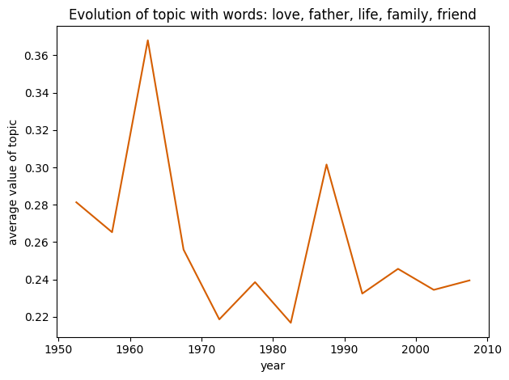

The evolution of cinema over the years is truly remarkable. From the silent film era of the 1920s to the present day, where we are captivated by awe-inspiring special effects, movies have undergone a transformative journey. But it is not just about what we see and hear while watching movies which has changed. Many other metrics have varied over time such as runtime, budgets, and complexity of movies.

While chatting about the current blockbuster with friends many recurrent ideas come up: “Movies these days? Definitely getting longer. They're stretching out more than ever!”, “Movies these days are just simpler…”, or for the vintage lovers “All the best movies? Yeah, they're done and dusted. The new ones? Not a chance they'll top the classics!”.

In this blog post, we will quantitatively analyze the truthfulness of these and many other claims and see what the data has to say. To achieve that we will use different datasets from sources like [IMDb]([https://sdeveloper.imdb.com/non-commercial-datasets/](https://developer.imdb.com/non-commercial-datasets/)) and [CMU Movie Summary Corpus]([https://www.google.com/url?q=http://www.cs.cmu.edu/~ark/personas/&sa=D&source=editors&ust=1702986915157988&usg=AOvVaw31QAT1o9RzjJ_NicsdLmF-](http://www.cs.cmu.edu/~ark/personas/)), scraped data and many others.

## Let’s start with an easy one: did movies become longer in recent years?

To answer this question we focused on evaluating the average length of movies by considering only the 25 most-watched films each year. Why prioritize the most-watched? Well, people's perception of the average movie length varies based on what they're viewing. Even if a particular year featured numerous lengthy films that went unnoticed, these wouldn't significantly impact the perceived average length of movies.

The 25 most popular movies were selected by ranking movies every year by the number of votes on IMDB. We aren’t taking the ratings into account because what we were trying to estimate with this metric is how many people have watched the movie. So a movie can be a perfect 10/10 while only 4 people actually watched it.

The plot shows some clear trends:

* 1930 - 1960: movies’ length continuously increased probably due to the technological development of the movie industry.
* Between 1960 and 1990, movie lengths saw a slight 10-minute drop on average. While it's hard to pinpoint the exact cause, changes in consumer preferences could be a contributing factor.
* 1990 - 2010: a steady increase is visible in this time range with average movie length getting a little higher than in the 60s.

So to finally answer our first question: movies got way longer compared to the earliest movies taken into account (1930s). Movies today are also slightly longer than those in the 80s, which might explain why some have the perception that films have gotten longer. This is particularly true with millennials, as they've experienced a consistent upward trend in movie length throughout their lives.

## The best movies have already been recorded

Similarly to the previous question we only considered the 25 most-voted movies every year and took the average ratings from IMDB.

In this case, the urban myth that movies in the past were better than recent ones seems supported by the data. The best movies were made in the '60s while the worst one's in the ‘80s. One small shortcoming of such analysis is that all these ratings have been done in the last 20 years thus they don’t represent the opinion of people who saw the movie being released.

## How did the characteristics of a good change from now compared to the past?

The initial approach to tackle this question was to divide the movies in groups of five years (e.g. 2000-2005, 2005-2010) and for each group we regressed the box office revenue on all the other features. We were hoping to infer the importance of the coefficients from their absolute values and p-values. Our analysis didn’t yield satisfying results, as the budget was the only coefficient that had values significantly different from zero over the years.  In response, we narrowed our focus to the budget, examining how its impact on box office revenue evolved.

But first, since we’re talking about budget, let’s take a quick detour to look at how budgets changed over the year. In the following plots, both the budget and the box office revenue are adjusted for inflation, the data for this adjustment was taken from the [U.S Bureau of Labour and Statistics]([https://www.bls.gov/cpi/data.htm](https://www.bls.gov/cpi/data.htm)).

As before, we’re only considering the 25 most-voted movies for every year. And it’s quite clear that the movie industry has gotten way bigger. The inflation-adjusted budget had a four-fold increase in the last 30 years, while the revenue doubled. Even if the budget grew more slowly the movie industry is massively profitable, in fact only the 25 most popular movies consistently made around half a billion in revenue every year for the last 20 years.

Now, let’s go back to the original question which we now restrict to budget only: did the influence of budget change over time?

The answer is yes. Our findings revealed that, compared to the past, the budget is a more reliable predictor of box office revenue in recent years. We observed a shift in the significance of budget around the year 2004. Regressing the adjusted box office revenue on the adjusted budget for movies before 2004 leads to an R-squared of 0.24, while for movies after 2004 we get an R-squared of 0.53.

The relation between budget and box office revenue can be seen more clearly in the following plots.

Here we can see that the linear regression line better fits the data after 2004. This has an important implication: in the last 20 years, the success of a movie (measured by box office revenue) depends much more on its budget. In the plot before 2004 we can see that there were quite a lot of outliers with low budgets and high box office revenue, showing that it was indeed possible to make a very successful movie with little money. On the other hand, in recent years it's rare to make a successful movie with little money.

## What are the characteristics of movies that age well?

We all know about certain movies that were very popular for a few months after they came out but completely forgotten after one or two years. Conversely, some movies initially went unnoticed by the general public but gained significant popularity several years after their initial publication. We wanted to better understand which characteristics make a movie age well (i.e. become more popular as years go by) and which others make people forget it after a few months.

To evaluate this, we required a metric to gauge how the qualities of movies changed over the years. We utilized the [Way Back Machine]([https://web.archive.org/](https://web.archive.org/)) a web archive with periodic snapshots of all the majorly visited web pages on the internet. Luckily for us, it also has an API that enabled us to scrape the IMDB web page of a movie over the years. This allowed us to see how the ratings changed as the movie became older. Specifically, we only scraped the ratings and number of voters after one and five years from the movie’s publication.

We decided to consider the average rating in the period between one and five years as an indicator of how well the movie aged. This is reasonable as it represents the opinions of people watching the movie after the initial hype regarding the movie release was gone.

The average rating in the range of one to five years is compared to the average after one year in the following histogram.

Next, we regressed the average rating in the period from one to five years after release on different characteristics of the movies. The R-square obtained from the regression is 0.522, which is acceptable given the complexity of the dependent variable we're trying to fit. The following are some of the conclusion that can be draws from the regression:

* The aging of movies highly depends on the reviews after one year (p=0.000 t=29.706). This means that the aging of a movie depends on the initial opinion that people had of it. A unit point increase in the review of a movie after one year leads to a 0.85 increase in the average rating in the following 4 years.
* Adult movies tend to age better compared to the average movies.
* Shorts movies age worse than the average movie while TV series age better. This logic holds true because TV series have a longer transmission duration. Therefore, within the first five years from the release of the first episode, newer episodes may continue to debut, mirroring the impact of a movie release and thus leading to higher ratings for a longer period of time.

## Unraveling Complexity: The Evolution of Movie Plots

In the dynamic world of cinema, storytelling has traditionally thrived on intricate plots, rich characters, and unexpected turns—from classics like "Citizen Kane" to Spielberg's epics. However, the turn of the millennium brought a shift, notably in franchise filmmaking, simplifying narrative structures for mass appeal.

This trend, observed in superhero movies, shifted focus from intricate character development to visual spectacle within interconnected universes. To examine and quantify this shift, two approaches emerged: one analyzes movie metadata, deriving a complexity score, while the other explores linguistic complexity. These methodologies aim to uncover the evolving nature of storytelling in cinema.

## Decoding Cinematic Complexity: At first glance

The initial approach relies on easily computable aspects of movies, specifically, the number of words in the plot summary and the runtime in minutes. By calculating a complexity score as the ratio of plot summary words to runtime in minutes, this method provides a numerical indicator of information density. This ratio serves as a snapshot of the amount of information conveyed per unit of time, enabling a comparative analysis across films of varying lengths.

However, this method inherently assumes that a higher word count in the plot summary correlates with a more complex narrative. While it effectively captures the volume of information, it may overlook the nuances of storytelling intricacy that extend beyond mere quantitative measures. Conversely, extremely short movies are disproportionately favored. They may receive a higher score than long and intricate movies, possibly due to the lack of detailed descriptions and the consequent brevity of their plot summaries.

Let's begin with a straightforward analysis: how have the number of words used in movie plots and their runtimes evolved over the years? We can easily compute the mean value and a 95% confidence interval, grouping by year for both quantities.

The number of words in plot summaries appears to steadily increase over the years, net of fluctuations, and it seems to approach a plateau around the 1980s. On the contrary, excluding the 1920-30 years, which are characterized by a large confidence interval, the runtime also shows an increase (here we’re taking into consideration all movies available in the dataset). However, it appears to have reached a plateau earlier than the number of words, around the 1960s.

Delving deeper into the analysis and computing the length/runtime complexity score, we observe a decrease in the complexity of movies between the 1920s and 1970s. However, after 1980, with the emergence of blockbuster cinema, the complexity remains relatively constant.

## Lexical Complexity: Will emails and instant messages simplify our language?

Delving into linguistic intricacies, the second approach endeavors to assess complexity through the richness of our lexicon. We can define various complexity scores as a ratio of complex words to the total number of words. In this discussion, we'll refer to lexical richness indices outlined by J. Torruella and R. Capsada in their article "Lexical Statistics and Topological Structures: A Measure of Lexical Richness" (2013). These methods aim to quantify the nuances of language embedded in storytelling.

This approach recognizes that the genuine measure of complexity extends beyond word quantity to encompass the quality of language use. It acknowledges the potential for succinctness in conveying profound ideas and emphasizes the impact of meticulously chosen words in shaping the narrative landscape. The underlying question lingers: as we engage in more emails and instant messages, are we witnessing a potential simplification of our language?

Now, let's break down our analysis step by step. We'll consider two variations of two interesting measures of lexical richness defined by Torruella: the Token-Type ratio (TTR) complexity and the mass complexity index. The TTR complexity is the ratio between the number of the most complex tokens in the text, excluding the 5000 most common words according to the Corpus of Contemporary American English (COCA), over the total number of tokens in the text. The mass complexity, on the other hand, is a second-class index defined in terms of the logarithms of the aforementioned quantities.



The trends observed in the complexity indices for these plots exhibit notable distinctions, yet they collectively imply a decrease in complexity from 1970 to the present. Specifically, the Type-Token Ratio (TTR) complexity appears to have remained relatively stable in the initial phases of cinematic history and then initiated a discernible decline since the 1970s. On the other hand, the mass complexity demonstrates an even more pronounced decrease, commencing from the early days of cinema in the 1920s, reaching a plateau between the 1940s and 1970s, and subsequently experiencing a renewed and substantial decrease since the 1970s.

In essence, both complexity indices depict a shift towards less intricate narratives over time, with TTR showing a more gradual decline post-1970 compared to the sharper decrease observed in mass. This overarching pattern suggests a noteworthy simplification in the structure and content of movie plots, highlighting a transformative trend in storytelling conventions from the 1970s onward.

Why did the complexity of movie plots start dwindling around 1970? The decrease in movie plot complexity post-1970 may partially reflect changes in communication patterns influenced by the advent of email and instant messaging during the same period.

## Movie topic evolution

In this section, we will look at how the topics of movies evolved over time. To do this, we have to have some way of defining topics and what topics a movie is about. We could  do this by for example simply looking at the genre of a movie, but this might not be very representative. Instead, we do this in a data-driven way! Specifically, we perform Latent Dirichlet Allocation (LDA) on the whole corpus of movies.

### Latent Dirichlet Allocation

Latent dirichlet allocation is method that is used to extract topics from a collection of text documents. Specifically, we specify the amount of topics to the algortihm and it then determines the right topics and represents them as probability distributions over words. Then, each document is represented as a probability distribution over the found topics. In this way, the method finds a collection of topics that can easily interpreted by the most important (/the most likely) words in each topic. Then for each document, by looking at the computed value for each topic, we can see how present each topic is in that document. 

When we perform LDA with six topics on the whole dataset of movie plot summaries, the method finds the topics below, represented by their highest scoring words. We can further interpret them by looking at movies that had a high score for these topics.

- **Topic 1 kill, police, murder, money, shoot, gang, car, escape** Looking at these words, it seems like this topic represents "gangster"-movies. Movies like "The Killers" and "Gang Related" were among the most highest scoring movies on this topic.
- **Topic 2: war, kill, soldier, army, force, order, return, american** This topic clearly represents war movies, as most of these words are very war-related. The movie "Taegukgi", which is about the Korean war, is the highest scoring movie for this topic. Also the popular war movie "Saving private ryan", scores very high on this topic.
- **Topic 3: house, try, run, kill, come, room, night, away** This topic is maybe a bit harder to interpret when only looking at the words. We see words like kill, run, away, night which could indicate that it has a strong horror component. Furthermore, the horror movies Night of the Demons, Paranormal Activity, were the two most highest scoring movies for this topic.
- **Topic 4: love, father, life, family, friend, mother, day, meet**  These words seem to be about family, friendship, love. It looks like topic mostly represents romantic/family/"feel good" movies. 
- **Topic 5: team, ship, destroy, world, new, crew, earth, time** These words seem to point towards superhero/science-fiction movies. For example the movies "The Avengers" and "Star Trek" were among the highest scoring movies for this topic.
- **Topic 6: king, fight, kill, story, return, father, help, village** This topic seems to represent fantasy/adventure movies. The highest scoring movie for this topic is "The Black Cauldron", which is a fantasy/adventure movie.
  
As we can see, these topics are quite interpretable! 

### Evolution of importance of topics

After performing LDA, we thus have the important topics, and for each movie values for each of these topics, specifiying how important each topic is in this movie. Now, we can look at how the importance of each topic evolved through time. This gives us an idea of which topics where important when in the movie industry. We hypothesize that the movie industry is a reflection of the current culture climate. We check if this is the case by trying to link the importance of topics in different time periods and their evolution through time, to the current cultural climate and societal events. 

Specifically we split the dataset into periods of 5 years. We only look at movies from 1950 onwards, as for this makes sure that we have enough data for each time period. Then for each period, we take a weighted average of the topic distributions of the movies. Each topic distribution is weighted by the box office revenue of the movie. This allows us to take into account the popularity of movies. This is an important part as we want to look at the important topics in each time period, and thus popular movies should be more strongly represented in this than less popular ones. In the following plot you can see the result of this calculation.

Take a look at this plot, there is a lot going on right? Some topics remain quite stable through time, so it is hard to make interesting analyses about them. Specifically, the topic with relevant words house, try, run, kill, come (previously interpreted as the horror topic) as well as the topic with relevant words king, fight, kill, story, return (previously interpreted as the fantasy/adventure topic) seem to remain relatively constant. Therefore we can conclude that they have remained popular topics in movies throughout time. However, things become very interesting when we look at the evolution of the other topics:
- War, relevant words: war, kill, soldier, army, force.
- Love, relevant words: love, father, life, family, friend.
- Science-fiction/Superhero, relevant words: team, ship, destroy, world, new.
- Gangster, relevant words: kill, police, murder, money, shoot, gang, car, escape.

#### War topic

Looking at the evolution of the topic that contains mostly words that can be linked to war movies, we see that this topic is still quite relevant in the period 1950-1960. This should be not too surprising, as this is the period right after the world had seen two big wars. It is not surprising that war was still an intriguing concept at that time! We see that as the two big wars were longer and longer ago, the war topic also became less and less prevalent in movies. From 1980s onwards the value remains mostly constant, and one can say that nowadays it is perhaps less cool to make a war movie.

#### Love topic

Love is in the air…? First thing that jumps into the eye is the big peak around the year 1960. This does not come as a surprise if we know the cultural climate of the sixties! Those times were marked by the hippie movement, which embraced values of love, peace, and camaraderie.

#### Science-fiction/superhero topic

In the importance of the science-fiction/superhero topic, and we can see an upwards trend. This can be attributed to the rising popularity of movies that are adaptations of superhero comic books. But there is more to it, we can see a first small peak on the late 1960s, for instance the famous Stanley Kubrick’s 2001: A Space Odessey was released in 1968. However, the huge peak is found in the 1980s and it does not come as a surprise since many classics were released in that period: Alien, E.T. the Extra-Terrestrial, Star Wars, Star Trek… and the lists follows.

#### Gangster topic.

The above plot is computed slightly different then the ones above, as this one only contains movies that were released in the US. When we look at this plot, we distinctly see two peaks. One in the period 1970-75 and one around the period 1990-95. Now look at the following figure displaying the homocide rate (a metric for crime) in the US from 1950 onwards.

This for sure is very far fetched, but we see that the crime rate follows a similar pattern, with also peaks in the period 1970-1975 and 1990-95!

Overall, when we look at the evolutions of the prevelance of topics in movies, it seems like we can link this to the cultural climate and the zeitgeist in these perdiods. This supports the hypothesis that the movie industry is a reflection of the current cultural climate

## Plot Originality

In this section, we dive into the world of originality in an attempt to unravel the thematic relationships between movies released within the same year. By comparing movies based on their topic content, we seek to understand whether the films produced in a given year tend to be original in their themes or conform to certain stereotypes. To achieve this, each movie is represented by a probability distribution over six predefined topics, such as [(1,0.5), (4,0.5)], indicating that the movie encompasses 50% of topic 1 and 50% of topic 4. Our similarity method uses the cosine similarity between these topic vectors of different movies in a pairwise comparison with movies released the same year. Movies with higher average cosine similarity are closer to many other movies meaning they are composed of many different topics, creating a more unique thematical narrative. While films containing just one topic will only be similar to the ones of the same type and therefore have low average cosine similarity. Finally, we compute the average cosine similarity per year to get a grasp on which years have been to most original, or on the other hand, all released movies were sticking to some sort of genre.

Wow! A clear tendency can be observed from 1980s to the 2000s to create more stereotype-disrupting movies. This period comprises the 1990s which saw greater attention to multiculturalism as well as an advance on alternative media. However, this trend regresses when we enter the 2000s to 2010s… it would be fascinating to see how that continued to the 2020s.

Finally, let’s have a look at the individual films to get our nominees for the ADA Film Originality Awards 2023. Before this, we want to clarify that movie originality does not directly implicate this movie is either good or bad, but it was a stand-out movie in that year. For instance, on the most original category there is movies of different backgrounds and generally a bit long-winded, while the least original section is filled with 1970's movies about post-apocaliptycal situations caused from some virus or mutant invasion, which looks like it was really a thing back then.

#### The most original (within its year)

1. The Sea (2000)
2. They Still Call Me Bruce (1987)
3. Chocolate (2008)
4. The Horse Whisperer (1998)
5. Suzhou River (2000)

Here, the films are very varied and rambling. For instance, the first movie, "The Sea", is a Catalan film in which two young men and a woman who shared the same traumatic childhood experience during the Spanish Civil War are reunited years later at a hospital for tuberculosis treatment.

However, the second one, "They Still Call Me Bruce", is about a Korean man comes to America to thank the American GI who saved his life, but instead winds up running a struggling karate studio. It surely does not sound as profund as the first one, but here we are computing originality, and who would come with such idea?!

On third place there is "Chocolate" in which an autistic girl with powerful martial art skills looks to settle her ailing mother's debts by seeking out the ruthless gangs that owe her family money.

On forth place, we have "The Horse Whisperer", and finally some more famous names such as Robert Redford and Scarlett Johansson. In this movie the mother of a severely traumatized daughter enlists the aid of a unique horse trainer to help the girl's equally injured horse.

The most original ranking is closed by "Suzhou River" in which after getting out of prison, small-time crook Mardar stumbles upon a woman who looks exactly like his long-lost lover.

You can tell these are not your average blockbuster movies. These films are composed by intrincate plots mixing sets of different topics and are worth of being in the top 5 of the ADA Film Originality Awards 2023.

#### The least original (within its year)

1. Bug (1975)
2. The Hellstrom Chronicle (1971)
3. Stigma (1972)
4. Space Amoeba (1970)
5. Ikarie XB-1 (1963)

On the first place for least original movie, there is "Bug", a science fiction horror film that revolves around the emergence of fire-starting cockroaches that emerge from the earth's crust following an earthquake. Doesn't sound like that much common to me... however lots of apocaliptycal science fiction movies were done in the 1970s.

"The Hellstrom Chronicle" follows in second place. The film presents a fictional scientist's theory that insects could inherit the earth, interspersed with real footage of insect life. Mmm.. so again with the insects and the earth invasion? Weird, or not so much.

On third place, we have "Stigma" in which a doctor moves to a secluded community and soon discovers a deadly virus changing the town's young people.

On forth place there is "Space Amoeba", a Japanese science fiction movie featuring a space probe returning to Earth with an extraterrestrial amoeba that takes control of other organisms, turning them into giant monsters. By this small description, one can quickly tell this is the average science fiction film from the 1970s.

Finally, our top 5 of least original movies is "Ikarie XB-1" which narrates the journey of a spacecraft, Ikarie XB-1, as it travels to a mysterious star system, encountering various dangers and mysteries along the way.

And that would be our rankings! Thanks for tunning in to the ADA Film Originality Awards 2023.
